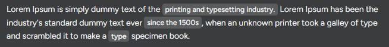
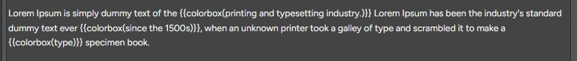

# Redmine Colorbox Plugin

This plugin adds a simple macro {{colorbox(...)}} to Redmine Wiki pages.

## Features

- Wraps text in a styled 
- Background color: #5A5B5D
- CSS is loaded via view hook

## Preview

## Installation

1. Clone or download this repository into your `plugins/` directory:

cd your_redmine/plugins
git clone https://github.com/Stefanikm/redmine_colorbox colorbox

2. Restart Redmine:

bundle exec rake tmp:cache:clear RAILS_ENV=production
touch tmp/restart.txt

3. Use it in your wiki:

{{colorbox(This is highlighted)}}

## Compatibility

Tested with Redmine 5.0+  
Works with any Redmine installation that supports macros and custom CSS.

## License

MIT
